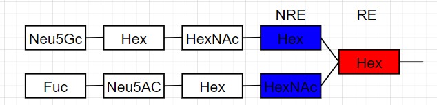
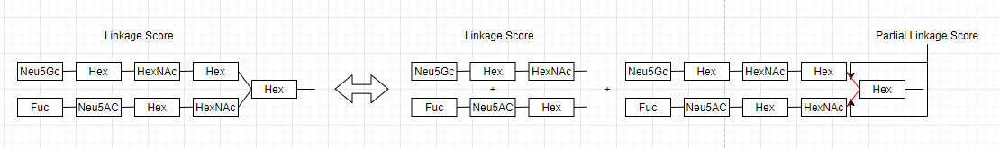

#LinkageClassifier
##Introduction
Linkage Classifier(LC) is an effective algorithm to evaluate the possibility for a imaginary linkage between two monosaccharides. Based on the score given by LC, the likelihood for a topology candidate can be determined. Combined with Ion Classifier, LC provides a convincing candidate for an unknown glycan.
###Ion Structure
For each peak in the spectrum data, a peak is a cleaved ion of the precursor ion(glycan). Some peaks are the cleaved part of larger peaks. A glycan topology which has a tree structure can represent the relationship between peaks. For each topology, a monosaccharide is set as **root**. The root connect several sub-topologies as **branches**. Multiple linkages bond the root and sub-topologies. The root of a sub-topology is called the **Non Reducing End(NRE)** of an ion. The root of a topology is called the **Reducing End(RE)** of an ion. Each peak has a single RE and may have multiple NREs. A linkage is determined as the NRE and RE is determined. The order of NRE and RE can't be changed, i.e. a "Hex-HexNAc" linkages is different from a "Hex-HexNAc" linkage.

###Data
LC requires two types of data as input.
- **Raw Spectrum Data**
  > Spectrum Data is collected from tandem mass spectra, including the $m/z$, $z$ and intensity of each peak. LC makes decisions based on the spectrum data. Before used by LC, raw spectrum will be pre-treated. All functions will require spectrum data. 
- **Annotation Data**
  > Annotation Data is generated by pre-treated spectrum data. Based on its theoretic topology, a glycan is cleaved and reform into all possible sub-topologies. By comparing the masses between the real peak data and theoretic topology, the peak is annotated if it's mass is close enough to a topology. Each peak which has a topology will be annotated with its link(NRE and RE monosaccharide type). Annotation Data is useful when training a Linkage Classifier.
###Notation
- $m$ mass, $i$ intensity, $p$ peak, $s$ spectrum, $t$ topology, $mo$ monosaccharide, $l$ linkage
- $S$ training spectrum set, $P$ peak set, $M$ monosaccharide set, $T$ topology set
- $d(x,Y) = \text{min}\left\{ |x - y| \mid y \in Y \right\}$
- $l(\text{NRE},\text{RE})$ a link that has non reducing end monosaccharide NRE and reducing end monosaccharide RE
- $n$ data size, $k$ num of monosaccharide types
###Outline
1. **Train**  LinkageClassifier is based on machine learning. So it need plenty of data to fit the model. Lack of data for a certain link will impede it's accuracy. To remove the influence of ion type, LC need to be trained separately for different ion types. LC makes decisions based on a peak's context, the differences of it and it's nearby peaks. After training LC will get a classification model and a set of mass difference as features.
2. **Predict single linkage**  The type of the peak must be determined first. The corresponding LC will be selected for prediction. LC searches the context of the target peak for the massfeatures. Combined with the normalized intensity, LC scores for all possible linkages. All scores is saved in a map named Linkage Score Map(LSM). The score of a peak for certain linkage is represented as $LSM(p, l)$.
3. **Predict topologies** A topology can be viewed as a combination of several linkages and branches. Recurring from smallest peaks, the algorithm sums up all of the linkage score and the branch score. The summation is set as the score of the topology. The top topology of the precursor ion is the estimated topology for the glycan. To make the algorithm more accurate, the score generated by IonClassifier is used.
##Train
###Pre-treatments
The raw spectrum data has redundant peaks. It need to be protonated and the peak need to be merged. After that, GlycoDeNovo reconstructs all possible topologies and attaches these topologies to corresponding peaks. To remove the redundancy in the data, LC finds unique masses in each spectrum so that trained massfeatures won't repeat. Peak intensities will be normalized by each spectrum for training. Since LC can't work on different ion types, peaks from one certain type will be used to train one LC.
###Context and MassFeatures
The context of a peak is defined as
$$\text{Context}(p^*) = \{m_p-m_{p^*}\mid\left |m_p-m_{p^*}\right | \in MassBound , p\in P_s\setminus p^*\}$$
By merging and sorting the context of all peaks in the training set $S$, LC get a vector of context called $\text{MassFeature}(S)$.
###DataVector
After calculating the $\text{MassFeature}(S)$, the MassFeature of a peak can be attained.
$$
\text{MF}(p^*) = (f_1, f_2,\dots,f_k) \quad s.t. \quad  k=\text{Dim}(\text{MF}(S))  \newline
f_i = \left \{ 
  \begin{array}{rcl}
  1  & if \quad d(\text{MF}_i, \text{Context}(p^*)) <MassBound \\
  0  & other
  \end{array}
\right.
$$
The normalized peak intensity represents the weight of the mass feature, Feature Intensity.
$$
\text{FI}(p^*) = (fi_1,fi_2,\dots,fi_k) \quad s.t. \quad k=\text{Dim}(\text{MF}(S)) \newline
fi_j = \left \{ 
  \begin{array}{rcl}
  i_p  & if \quad f_j = 1 , m_p - m_{p^*} = \text{min}\ d(\text{MF}(S)_j, \text{Context}(p^*))\\
  0  & other
  \end{array}
\right.
$$ 
A DataVector is the combination of MassFeature and FeatureIntensity
$$
\text{DataVector}(p^*) = (\text{MF}(p^*), \text{FI}(p^*))
$$
LC uses a DataVector to make one classification. It's output is a tuple containing the posterior probability of Poslink and Neglink.
$$
\text{LC}_{l_{pos}l_{neg}}(\text{DataVector}(p^*)) = (p_{pos}, p_{neg})
$$
The order of $l_{pos}$ and $l_{neg}$ is not important while using $\text{LC}$.
###Classification via Machine Learning
The classification part can be done by any classification algorithm. The model trains classifiers for all possible linkage(RE and NRE) pairs. For each pair a positive linkage and a negative linkage is selected. As the linkage pair is decided, LC collects all peaks which has been annotated with the linkage pair. DataVectors of peaks with the positive links are defined as the Positive Input Set. DataVectors of peaks with the negative links are defined as the Negative Input Set. The label set $Y$ has 1 and 0 with respect to the size of PosX and NegX.
$$
\text{PosX}(S) = (\text{DataVector}(p) )\quad \forall p\  s.t. \  l_p\text{ is positive link} \newline
\text{NegX}(S) = (\text{DataVector}(p) )\quad \forall p\  s.t. \  l_p\text{ is negative link} \newline
X = (\text{PosX}, \text{NegX}) \newline
Y = (\mathbb{I}, \mathbb{O}) \quad \text{Dim}(\mathbb{I}) = \text{Dim}(\text{PosX}) \quad \text{Dim}(\mathbb{O}) = \text{Dim}(\text{NegX})
$$
###Algorithm:TrainLC
```R
A <- AnnotationData
S <- RawSpectrumData
pl <- SearchPeaksWithLink(A, PositiveLinkage)
nl <- SearchPeaksWithLink(A, NegativeLinkage)
MassFeatures <- []
for s in S:
  PreTreat(s)
  for p in s:
    p.context <- GetContext(p)
    MassFeatures <- [MassFeatures, p.context]
mergeMasses(massFeatures)
for s in S:
  for p in s:
    p.massfeatures <- SearchMassFeaturesWithinMassBound(massfeatures, p.context)
    p.intensity <- FindNearestContextForEachMassFeature(p.context , p.massfeatures)
    p.datavector <- (p.massfeatures, p.intensity)
for p in pl:
  PosX <- [PosX, p.datavector]
for p in nl:
  NegX <- [NegX, p.datavector]
X <- [PosX, NegX]
Y <- [ones(PosX), zeros(NegX)]
LC <- Classify(X,Y)
```
###Generate LC Map
Any classifier $\text{LC}(l_{pos}, l_{neg})$ can be generated by this algorithm. A $\text{LC}$ is able to show a peak's tendency to have a PosLink rather than NegLink, as long as we have the peak's dataVector as input. Since a link is the permutation of the RE monosaccharide and the NRE monosaccharide, $\binom{k}{2} = k^2-k$ possible links can be generated. The number of possible LCs is the 2-combination of links $\mathrm{C}^2_{k^2-k} = \mathrm{O}(k^4)$. Link data below a threshold will be ignored so in training process $\text{LC}$ will only generate within a limited number.
##Predict single linkage
###Pre-treatments
Before prediction, spectrums should have reconstructed topology as candidates. linkage classifier will then score for each topology and offer a prediction. In order to score for all topologies, the score of a linkages need to be decided by $\text{LC}$. The peak with a candidate topology is transformed to dataVectors as input.
###Linkage Score for a peak
To get the score of a linkage, all scores produced by the $\text{LC}$s which has relative linkage will be used. The linkage score as defined as below
$$
\text{S}(l, p) = \text{min}\left \{ \forall l_{pos} = l \quad \text{LC}_{l_{pos}l_{neg}}(\text{DV}(p)[1], \forall l_{neg} = l \quad \text{LC}_{l_{pos}l_{neg}}(\text{DV}(p)[2])  \right\}
$$
Note that a linkage has the information of two peaks, the NRE monosaccharide and the RE monosaccharide. A peak's monosaccharide type is the NRE monosaccharide type of its linkage. If a peak has high linkage score, it represents that the peak has higher probability to be a monosaccharide as the NRE and it's more likely to link to a peak which has a monosaccharide as the RE. This information will be useful in determining the topology of a peak. By evaluating the score for each linkage, the score can be mapped by the link $l$ and the peak $p$. This map is called **LinkageScoreMap(LSM)** in the algorithm.
###Algorithm: getLSM
```R
LSM <- EmptyMap
for l in L, p in P:
  score <- LargeNum
  for lc in AllLinkageClassifiers:
    if lc.posL == l:
      score = min(score, lc(p).PosScore)
    if lc.negL == l:
      score = min(score, lc(p).NegScore)
  LSM(l, p) = score
```
##Predict a topology
###Peak and Topology
As mentioned, a topology has a tree structure whose root is the monosaccharide and branches are the sub-topologies. In this tree each node is supported by a peak. Classifiers can evaluate the property of the peaks and thus evaluate the probability of a topology to be true. 
###Peak properties
- **Ion**  During tandem mass spectra, a glycan is cut into ions. There are different types of ions such as A,B,X,Y ion. The type of ions can be estimated by IonClassifier(IC).
- **Root Monosaccharide** The monosaccharide type of the root.
- **Linkage** As long as the peak is not the precursor ion, it will link to another peak as its branch. The type of linkages can be estimated by LC.
###Topology Linkage Score
One LC can only classify peaks with one specific ion type, but the probabilities of a peak to be various ion types are different. In order to get a more accurate score, the score of IC and the score of LC is combined. The score of a linkage in the topology is
$$
\text{S}(NRE,RE) = \sum_{i \in I} \text{IC}(i,\text{supportpeak}(NRE))\text{LC}(l(NRE,RE),\text{supprotpeak}(NRE))
$$
The score of a topology is the summation of all its linkages scores. To avoid redundant evaluation, the algorithm sums up the branch topology scores and the partial linkage scores.
For each topology, it's score equals to the summation of its branch topologies and linkages whose NRE is the branch root and RE is the root.
###Algorithm: getTopologyScore(TP)
```R
TPscore <- 0
for bTP in TP.branches:
  TPscore <- TPscore + bTP.score
  NRE <- bTP.RootMono
  RE <- TP.RootMono
  for i in IonTypes:
    TPscore <- TPscore + IC(i, bTP.SupportPeak)*LC(link(NRE,RE), TP.SupportPeak)
```

The topology of the precursor ion is the estimation of the glycan. Linkage Classifier sort the topologies of precursor ion and make prediction from the topology with greatest score.

###Question
- Why not use monosaccharide classifier directly?